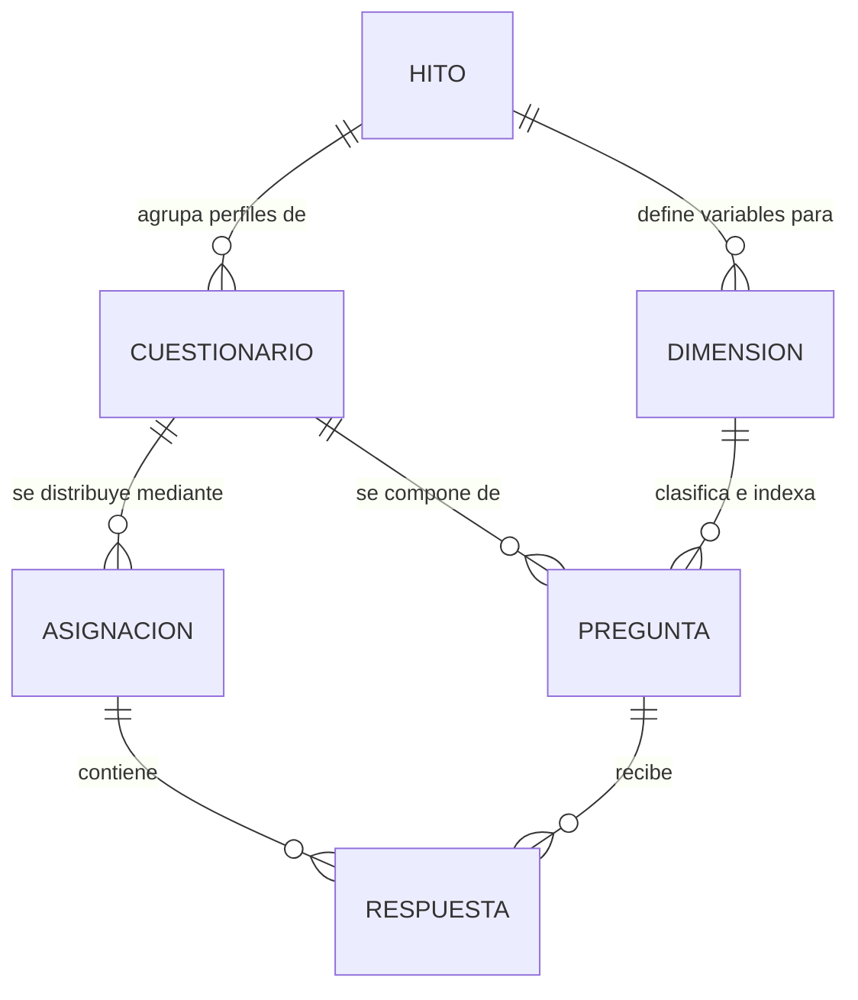

# RunaFoto - Sistema de Investigación y Descubrimiento Organizacional
## Consola Unificada de Descubrimientos Estratégicos (Astro + Svelte + PostgreSQL)

Este sistema web está diseñado para realizar investigaciones organizacionales avanzadas y auditorías de procesos en empresas. Su objetivo no es medir el desempeño individual de las personas ni actuar como un software de encuestas convencionales; su propósito es **descubrir fricciones operativas y fugas de valor internas** mediante campañas de investigación sistemáticas.

El sistema se estructura en torno a un **modelo operativo de 5 etapas secuenciales**, optimizado para que directores y consultores externos puedan configurar, lanzar y analizar los descubrimientos sin necesidad de capacitación técnica previa.

---

## 1. Filosofía del Sistema y Modelo de Datos

### La Filosofía del Descubrimiento
El software asume que toda fricción en la entrega de valor a los clientes (atrasos, retrabajo, desactualización de datos) responde a problemas en el sistema de trabajo, no a negligencias individuales. Por ello:
* **No hay culpables:** Los resultados se consolidan por rol y dimensión.
* **Hipótesis de Trabajo:** Toda percepción recolectada en los formularios se considera una hipótesis que debe cruzarse con al menos otra fuente de información (Matriz de Validación de doble entrada).
* **Foco en el Crecimiento:** El crecimiento no es solo vender más, sino aumentar la capacidad instalada reduciendo la dependencia de fundadores o personas indispensables, y ordenando la información.

### Modelo de Datos Relacional



1. **Hito (Campaña Activa):** Representa una ola de investigación temporal (ej: "Descubrimiento Organizacional Q1 2026"). Todo el sistema funciona filtrado por la campaña activa, aislando los datos históricos.
2. **Dimensión de Análisis:** Agrupa y clasifica las preguntas bajo 5 ejes estratégicos del negocio (Comercial, Operativa, Información, Organizacional, Escalabilidad).
3. **Cuestionario (Rol/Público de Evaluación):** Define el conjunto de preguntas específicas adaptadas a la jerarquía o función de la persona que responde (Dirección, Ventas, Escuela, Coordinación, Producción, Administración).
4. **Asignación (Enlaces de Acceso):** Representa un token seguro y único (`/q/[token]`) de dos naturalezas:
   * **INDIVIDUAL:** Para colaboradores clave (ej. Douglas). Permite responder una única vez y luego inhabilita el enlace.
   * **GRUPAL:** Para departamentos enteros (ej. Fotógrafos de campo). Permite múltiples envíos hasta alcanzar una muestra esperada de sesiones únicas (`sesionId`).
5. **Respuesta:** Almacena los valores ingresados en formato `JSONB`, junto con la firma del dispositivo (`deviceId`) y el identificador de sesión.

---

## 2. Marco Estratégico de Investigación (Las 6 Dimensiones - v10)

Toda la información recolectada se distribuye en una y solo una de las siguientes dimensiones:

| Dimensión | Pregunta Clave que Resuelve | Ejes de Fricción Evaluados |
|---|---|---|
| **1. Negocio y Crecimiento** | ¿Qué líneas tienen potencial y cuáles consumen más recursos o dependen de Douglas? | Potencial por línea, dependencia de personas clave, subsidios cruzados y prioridades de crecimiento a 12 meses. |
| **2. Comercial** | ¿Qué distingue a la venta de cada línea de negocio? | Diferencias reales entre Bodas, Empresas, Escuela, Promofest y XV, conversión por línea, objeciones y velocidad de contacto. |
| **3. Operaciones** | ¿Qué demoras o conflictos operativos sufre el equipo al entregar? | Estacionalidad, capacidad instalada, conflictos por recursos compartidos y estandarización del flujo de entrega. |
| **4. Información** | ¿Dónde viaja el dato maestro y quién tiene permiso de modificarlo? | Redundancia de datos, uso de canales informales (WhatsApp), y discrepancia entre proyecciones y facturas reales. |
| **5. Organización** | ¿Quién toma las decisiones y cómo de rápido escala un nuevo colaborador? | Centralización, sucesión ante ausencias, y falta de documentación en procesos clave. |
| **6. Tecnología y Automatización** | ¿Qué herramientas conectan los datos y qué procesos están listos para automatizar? | Integración con WhatsApp, Contasis, CRM, uso de Inteligencia Artificial y autogeneración de documentos. |


---

## 2.1 Seguridad y Autenticación de la Consola

Para mitigar riesgos de acceso no autorizado y proteger los datos estratégicos recopilados:
* **Acceso Restringido:** La consola ha sido reubicada a `/administrador` y requiere inicio de sesión obligatorio.
* **Sesiones Seguras:** Las sesiones se gestionan mediante cookies de seguridad de 7 días (`HttpOnly`, `SameSite=Lax`) sincronizadas con una tabla de base de datos (`administrador_sesion`), permitiendo la invalidación remota.
* **Hash de Contraseñas:** Se utiliza el algoritmo de derivación de claves `Scrypt` nativo de Node.js con sal única dinámica por usuario, previniendo ataques de tabla arcoíris.

---

## 3. Proceso Operativo para el Administrador (Guía de 5 Pasos)

Toda la administración se realiza a través de un **Stepper Horizontal Glassmorphism** ubicado en la parte superior de la consola de administración (`/administrador`), el cual guía al operador de forma secuencial:

### Paso 1: Campaña (Crear o Seleccionar Investigación)
Define la campaña activa sobre la cual se ejecutará todo el diagnóstico.
* **Opciones de la Interfaz:**
  * **Listado de Investigaciones Registradas:** Tabla con la participación, cantidad de enlaces activos, estado (🟢 Activa / Inactiva) y botón para activar.
  * **Formulario de Creación Rápida (Columna Derecha):** Campo para ingresar el nombre de la nueva campaña y dropdown para **Clonar Estructura** (heredar dimensiones, cuestionarios y preguntas de una campaña base anterior sin copiar las respuestas).
* **Casuísticas y Reglas de Negocio:**
  * Al clonar, las preguntas se copian con su versión original en 1, pero desvinculadas de cualquier enlace o respuesta anterior.
  * Solo una campaña puede estar **Activa** simultáneamente. Al activar una, las demás se marcan automáticamente como inactivas.
* **Qué se espera:** Que el administrador seleccione una campaña existente o cree una nueva. Esto desbloquea los siguientes pasos y actualiza la URL con el parámetro `?hitoId=[UUID]&tab=campana`.

### Paso 2: Dimensiones (Configurar Variables de Análisis)
Define las variables teóricas que organizarán las preguntas del levantamiento.
* **Opciones de la Interfaz:**
  * **Tarjetas de Dimensiones Inline:** Muestran el código (ej. D1), el nombre, la descripción y un color distintivo.
  * **Edición Inline Dinámica:** Al hacer clic en "Editar", la vista de la tarjeta se reemplaza en su lugar por un formulario de edición rápida, permitiendo cambiar el código, descripción o color de inmediato sin modales molestos.
  * **Formulario de Creación de Dimensiones:** Ubicado al lado de las tarjetas para añadir nuevas clasificaciones.
* **Casuísticas y Reglas de Negocio:**
  * **Protección de Datos:** El sistema bloquea el borrado de dimensiones si ya tienen preguntas asociadas en la base de datos para evitar la rotura de integridad.
* **Qué se espera:** Tener las 5 dimensiones teóricas inicializadas. Esto poblará automáticamente los dropdowns de dimensiones en el constructor de preguntas.

### Paso 3: Roles y Preguntas (Diseñar el Constructor de Preguntas)
Configura los perfiles de evaluación y edita el set de preguntas y alertas para cada rol.
* **Opciones de la Interfaz:**
  * **Lista de Roles a Evaluar (Columna Izquierda):** Muestra los roles creados (ej. Dirección, Ventas) con contador de preguntas. Cuenta con un formulario inline superior para agregar roles al instante (`➕`). Al seleccionar un rol, se le asigna el badge `🟢 Activo`.
  * **Formulario de Creación de Preguntas (Columna Central):** Campo de Código (ej. `DIR_01`), selector de Dimensión asociada, Enunciado de la pregunta, selector de Tipo (`OPCION_MULTIPLE`, `ORDEN`, `BOOLEAN`, `CORTA`).
  * **Selector de Respuesta Crítica Dinámico:** Al ingresar opciones en preguntas cerradas, el sistema dibuja automáticamente botones radio para que el administrador haga clic en la opción que representa una **Fuga de Valor** (Alerta de Fricción).
  * **Visualizador de Preguntas del Rol (Columna Derecha):** Lista interactiva con scroll de las preguntas cargadas para el rol, con sus tipos, alertas configuradas y botones para editar inline o eliminar.
* **Qué se espera:** Completar la carga de las preguntas estratégicas por rol antes de comenzar a emitir enlaces.

### Paso 4: Lanzamiento (Generar y Monitorear Enlaces Seguros)
Configura el acceso y distribuye los tokens de entrada para los evaluados.
* **Opciones de la Interfaz:**
  * **Formulario de Creación de Enlace:** Selección de Rol a evaluar, ingreso del Identificador (ej. "Douglas" o "Área de Edición"), Tipo de Sujeto (Individual o Grupal) y Muestra Esperada.
  * **Tabla de Distribución de Enlaces:** Muestra el Identificador, el Rol asociado, el Avance de Participación, el Estado actual (`Borrador`, `Test`, `Lanzado`) y el botón "Administrar →" para desplegar el Panel Lateral (Drawer).
  * **Panel Lateral (Drawer) de Gestión en Vivo:**
    * **Copiar URL de Acceso:** URL segura (`/q/[token]`) para compartir.
    * **Cambio de Estado:** Permite cambiar el estado del enlace.
    * **Vista Previa de Preguntas:** Muestra la lista de preguntas que verá el usuario.
    * **Auditoría de Terminales:** Monitorea colisiones de dirección IP y dispositivo en vivo.
    * **Zona de Peligro:** Permite eliminar el enlace y todas las respuestas asociadas de forma permanente.
* **Casuísticas y Reglas de Negocio:**
  * **Aislamiento de Pruebas (Modo Test):** Los enlaces configurados en estado `Test` registran respuestas para verificar el correcto funcionamiento del colector, pero se omiten automáticamente en el panel ejecutivo de resultados.

### Paso 5: Resultados (Panel Ejecutivo de Descubrimientos)
El espacio de toma de decisiones para los líderes organizacionales. Se divide en tres sub-pestañas:
1. **Analíticas:** Consolida la tasa de participación, total de respuestas recolectadas y la cantidad de Fugas de Valor activas. Muestra un desglose porcentual de fricción por Dimensión y tarjetas de Alertas Críticas ordenadas por nivel de recurrencia.
2. **Comparativo Temporal:** Cruza la campaña activa con una campaña histórica (línea base) a través de preguntas homónimas (con el mismo código de pregunta), indicando si la fricción ha mejorado (📉), empeorado (📈) o permanecido estable (➖).
3. **Auditoría de Terminales:** Lista incidentes de colisión física de dispositivos (múltiples sesiones desde un mismo terminal) para evitar duplicados o fraudes de muestras.

---

## 4. Lógica de KPIs y Alertas Críticas (Fugas de Valor)

### A. Fórmulas de Participación y Avance de Muestra
1. **Tasa de Participación Global de Campaña:**
   $$\text{Participación Global (\%)} = \left( \frac{\text{Asignaciones Lanzadas Completadas}}{\text{Total Asignaciones Lanzadas}} \right) \times 100$$
2. **Progreso de Enlaces Grupales:**
   Identifica las respuestas agrupadas asociadas a la `asignacion_id` y cuenta el número de sesiones únicas (`sesionId` generadas por el cliente):
   $$\text{Progreso Grupal (\%)} = \min\left(100, \left( \frac{\text{Sesiones Únicas Recibidas}}{\text{Muestra Esperada}} \right) \times 100\right)$$
   Al llegar al $100\%$ de cobertura, el enlace se cataloga administrativamente como completado.

### B. Algoritmo de Detección de Fugas de Valor
Una fuga de valor (Alerta Crítica) se consolida cuando la respuesta del colaborador coincide exactamente con la `respuesta_critica` configurada. El validador se ejecuta en el backend mediante la siguiente lógica insensible a mayúsculas y espacios:

```typescript
const esFugaDeValor = (valorRespuesta: any, valorCritico: string | null): boolean => {
  if (!valorCritico) return false;
  
  const normalizar = (val: any) => String(val).trim().toLowerCase();
  
  // Si la respuesta es de tipo ordenamiento (array de prioridades)
  if (Array.isArray(valorRespuesta)) {
    // Se evalúa si el primer elemento prioritario representa la fuga de valor
    return valorRespuesta.length > 0 && normalizar(valorRespuesta[0]) === normalizar(valorCritico);
  }
  
  return normalizar(valorRespuesta) === normalizar(valorCritico);
};
```

---

## 5. Mapeo de Preguntas de Investigación vs. Alertas de Fricción (v10)

Para evitar conexiones forzadas y asegurar que cada pregunta recolectada alimente una hipótesis real de negocio, en la **v10** el flujo conversacional se simplificó, y la mayoría de preguntas se configuraron como de texto abierto (`CORTA`) para obtener contexto estratégico cualitativo profundo. 

Las preguntas cerradas con respuestas críticas preconfiguradas que disparan **Fugas de Valor** automáticas en el panel ejecutivo son:

| Cuestionario (Rol) | Código de Pregunta | Pregunta / Control | Tipo de Control | Respuesta Crítica (Fuga) | Hipótesis Estratégica que Alimenta |
|---|---|---|---|---|---|
| **PRODUCCIÓN** | `PRO_01` | ¿Qué tan seguido esperas aprobación para continuar un trabajo? | OPCION_MULTIPLE | `"Todos los días"`, `"Varias veces por semana"` | Mide retrasos y cuellos de botella por centralización de supervisión o validación. |
| | `PRO_02` | ¿Qué tan seguido cambia el alcance de un trabajo ya iniciado? | OPCION_MULTIPLE | `"Todos los días"`, `"Varias veces por semana"` | Mide la frecuencia de retrabajo por cambios informales sobre la marcha o desorden. |
| | `PRO_03` | ¿Qué tan seguido repites un trabajo que ya habías hecho? | OPCION_MULTIPLE | `"Todos los días"`, `"Varias veces por semana"` | Cuantifica el retrabajo crónico y fallas de comunicación en el equipo técnico. |
| **FINANZAS / CONTABILIDAD** | `YER_01` | ¿Qué tan seguido el mismo pago te obliga a revisar más de un lugar? | OPCION_MULTIPLE | `"Todos los días"`, `"Varias veces por semana"` | Alerta sobre la desorganización de datos e inconsistencia contable. |


---

## 6. Configuración Técnica y Ejecución Local

### Prerrequisitos
* Node.js v22 o superior
* Docker Desktop (para la base de datos PostgreSQL)

### Instrucciones de Despliegue Rápido
1. **Levantar Base de Datos:**
   ```bash
   docker compose up -d
   ```
   *Esto inicializa PostgreSQL en el puerto `5433` con credenciales seguras.*
2. **Instalar Dependencias:**
   ```bash
   pnpm install
   ```
3. **Poblar la Campaña Estratégica (Seeding):**
   Para cargar la campaña inicial con las 5 dimensiones, los 6 roles y todas las preguntas descritas anteriormente, ejecuta:
   ```bash
   pnpm run astro db seed
   # O directamente mediante el script de respaldo:
   psql -h localhost -p 5433 -U runafoto_user -d runafoto_cuestionarios -f seed.sql
   ```
4. **Ejecutar en Desarrollo:**
   ```bash
   pnpm run dev
   ```
   *Abre [http://localhost:4321](http://localhost:4321) en tu navegador.*

### Compilación y Construcción de Producción
Para verificar la salud general del tipado y generar el build optimizado:
```bash
npx astro check
pnpm run build
```
