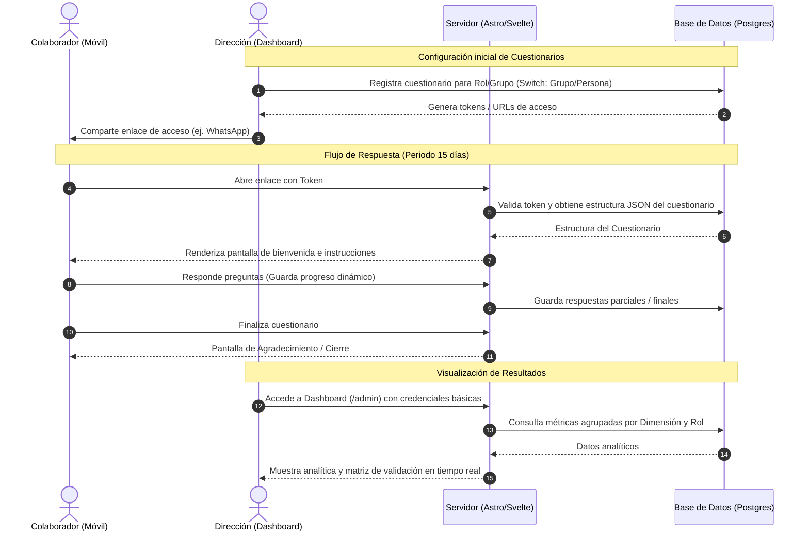
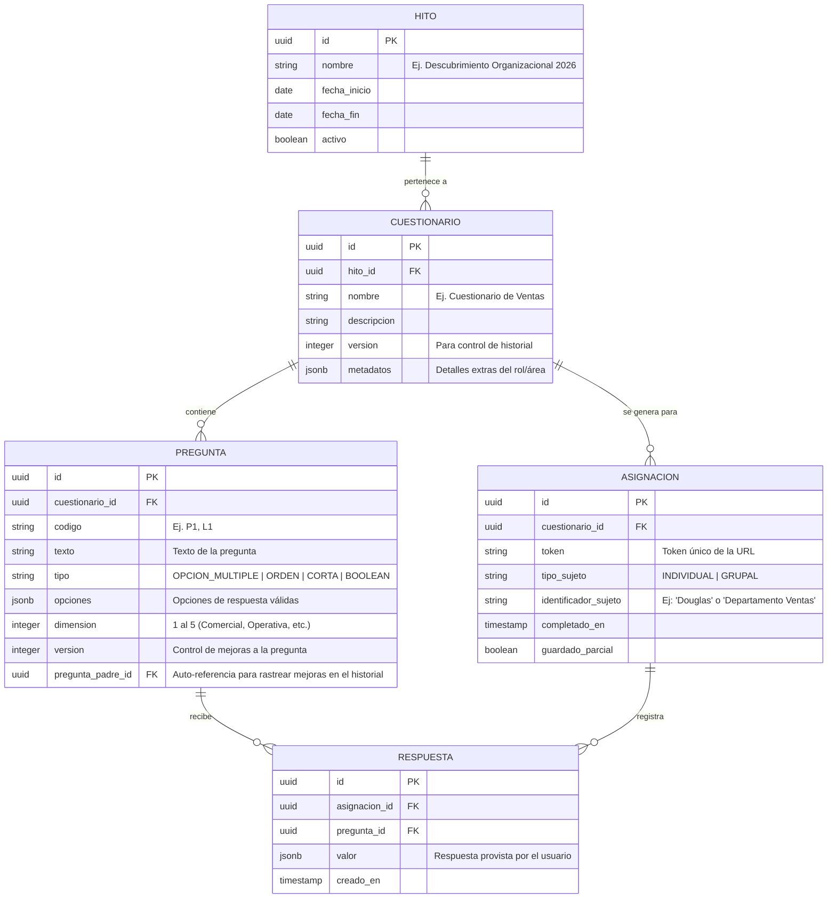

# Especificación del Producto (Product Specification) - FASE 1
## Sistema de Levantamiento Estratégico de Información - Grupo RunaFoto

Este documento define el alcance, la arquitectura funcional y los criterios de éxito del sistema interno de levantamiento estratégico de información para Grupo RunaFoto. Su objetivo es establecer las bases funcionales antes del diseño UX y UI.

---

## 1. OBJETIVO DEL SISTEMA
Desarrollar una aplicación web móvil-first interna, altamente reutilizable, que permita realizar levantamientos estratégicos de información organizacional en Grupo RunaFoto. El sistema debe facilitar a los colaboradores responder cuestionarios adaptados a sus roles de forma ágil, y proveer a la Dirección un panel de análisis (dashboard) centralizado para tomar decisiones basadas en datos objetivos, eliminando el uso de hojas de cálculo dispersas o chats informales para la recolección.

---

## 2. ALCANCE Y LÍMITES
El sistema no es una plataforma de encuestas públicas (como Typeform o Google Forms genéricos), sino una herramienta de investigación organizacional estructurada y persistente en el tiempo.

### En Alcance:
*   **Motor de Cuestionarios Dinámico:** Los cuestionarios se estructuran a partir de definiciones en base de datos/JSON, lo que permite reutilizar el software para futuras campañas de diagnóstico ("hitos") simplemente cargando nuevas configuraciones.
*   **Historial y Trazabilidad de Preguntas:** Capacidad de versionar cuestionarios y rastrear si una pregunta específica fue mejorada o modificada en hitos posteriores, manteniendo el histórico de respuestas del pasado.
*   **Identificación Flexible de Colaboradores (Asignación):**
    *   **Evaluación Individual:** Cuestionarios dirigidos a una persona en específico para analizar su rol individual.
    *   **Evaluación Grupal / Departamental:** Un link único distribuido a un grupo/departamento. El sistema consolida las respuestas recibidas bajo el identificador de ese grupo (evaluación al área, no al individuo).
    *   **Switch de Configuración:** Posibilidad de definir en cada cuestionario si se evalúa a un "Grupo" (anonimizado/consolidado por área) o a una "Persona".
*   **Acceso Simplificado (Sin Autenticación Compleja):** Los colaboradores ingresan a responder mediante URLs con tokens o identificadores únicos (ej: `/q/ventas-grupo-abc` o `/q/direccion-douglas-xyz`), reduciendo la fricción y maximizando la tasa de respuesta en el periodo de 15 días.
*   **Dashboard y Analítica Interna:** Panel de control de acceso restringido para Dirección y Consultores que muestre:
    *   Tasa de finalización por rol/grupo.
    *   Respuestas consolidadas por Dimensión Estratégica (Comercial, Operativa, Información, Organizacional, Escalabilidad).
    *   Alertas de Fugas de Valor detectadas.

### Fuera de Alcance (Primera Versión):
*   Autenticación de colaboradores mediante OAuth2, contraseñas o integraciones Active Directory (se gestionará mediante tokens de URL de uso único o por grupo).
*   Creador visual de cuestionarios "drag and drop" en el frontend (la creación/edición de plantillas de cuestionarios se hará mediante archivos de configuración JSON o scripts de inserción directa en la base de datos PostgreSQL).
*   Envío automatizado de recordatorios por SMS o WhatsApp (se generarán los enlaces para que los coordinadores los compartan manualmente).

---

## 3. PERFILES DE USUARIO (ACTORES)

| Perfil | Rol en RunaFoto | Acceso al Sistema | Responsabilidad / Acción |
|---|---|---|---|
| **Colaborador / Operativo** | Producción (Fotógrafos, editores, diseñadores), Ventas, Escuela, Administración | Web Móvil via Link Único | Responde las preguntas de su rol en menos de 15 minutos. Puede guardar progreso parcial si es necesario. |
| **Coordinador** | Jenne, Josefh | Web Móvil / Escritorio | Responde su cuestionario estratégico, comparte los enlaces de su equipo y monitorea verbalmente la participación. |
| **Dirección / Administrador** | Douglas, Betty, Consultor | Web Escritorio (Dashboard) | Define las líneas de investigación, visualiza gráficos por dimensión, exporta reportes y analiza las fugas de valor. |

---

## 4. RESTRICCIONES TÉCNICAS Y OPERATIVAS
*   **Tecnologías Obligatorias:** Astro (Estructura y Server-Side Rendering para velocidad), Svelte (Interactividad reactiva fluida en los formularios y dashboards), TypeScript (Tipado fuerte y robustez).
*   **Base de Datos:** PostgreSQL en contenedor Docker para portabilidad y facilidad de despliegue local o en servidor.
*   **Plazo de Ejecución Operativo:** El levantamiento real dura **15 días**. El sistema debe ser estable y capturar datos sin pérdidas desde el día 1.
*   **Enfoque Móvil (Mobile-First):** El 90% de los colaboradores responderá desde su teléfono celular. La interfaz debe optimizarse para una sola mano, bajo consumo de datos y alta velocidad de carga.

---

## 5. FLUJO GENERAL DEL SISTEMA

---

## 6. NAVEGACIÓN Y ARQUITECTURA DE PANTALLAS

### A. Experiencia del Colaborador (Móvil-First)
1.  **Pantalla de Bienvenida (`/q/[token]`):**
    *   Muestra introducción personalizada (ej. "Hola, equipo de Producción de RunaFoto").
    *   Aclaración de confidencialidad y principios del levantamiento (no evaluación de desempeño).
    *   Indicación del tiempo estimado (10-15 min) y switch visual si es encuesta "Grupal" o "Individual".
    *   Botón destacado: "Comenzar Cuestionario".
2.  **Pantalla de Cuestionario Activo:**
    *   Barra de progreso persistente en la parte superior.
    *   Visualización de preguntas en formato secuencial (tarjetas o scroll suave optimizado).
    *   Controles táctiles grandes adaptados al uso con una mano.
    *   Guardado automático al responder cada pregunta (evita pérdida de datos por pérdida de conexión).
3.  **Pantalla de Finalización:**
    *   Mensaje de confirmación de registro de respuestas.
    *   Resumen del hito y agradecimiento.

### B. Experiencia de Administración y Dirección (Escritorio)
1.  **Pantalla de Login (/admin/login):**
    *   Acceso simple con contraseña única del sistema de administración.
2.  **Dashboard Principal (/admin/dashboard):**
    *   Resumen de participación: Porcentaje de avance de los 15 días.
    *   Métricas de Dimensión: Puntuación de fricción o volumen de respuestas clasificadas en las 5 dimensiones (Comercial, Operativa, Información, Organizacional, Escalabilidad).
    *   Matriz de Trazabilidad y Fugas de Valor reportadas por Administración.
3.  **Gestor de Cuestionarios (/admin/cuestionarios):**
    *   Lista de cuestionarios creados, hitos activos e historial de versiones.
    *   Generador de URLs y exportador de datos consolidados a CSV/JSON.

---

## 7. ESTRUCTURA DE DATOS CONCEPTUAL (PostgreSQL)

Para garantizar la reusabilidad, historial y flexibilidad de asignación persona/grupo, se define la siguiente estructura de tablas lógicas:

### Justificación de la estructura para Reusabilidad e Historial:
1.  **Versionado en `CUESTIONARIO` and `PREGUNTA`:** Al mantener el campo `version` y la auto-referencia `pregunta_padre_id`, podemos modificar una pregunta en el futuro (ej. cambiarle la redacción para hacerla más clara) sin perder la relación con las respuestas antiguas de la versión previa. Esto resuelve la necesidad de comparar si las preguntas mejoradas tuvieron un impacto diferente en el tiempo.
2.  **El campo `tipo_sujeto` en `ASIGNACION`:** El switch solicitado ("Grupo" o "Persona") se implementa directamente en la asignación del enlace. Si es `GRUPAL`, múltiples colaboradores pueden abrir el mismo enlace y registrar respuestas (creando múltiples registros en `RESPUESTA` compartiendo el mismo `token` o agrupados bajo el mismo identificador de grupo). Si es `INDIVIDUAL`, el token se invalida tras el primer envío exitoso.

---

## 8. CRITERIOS DE ÉXITO Y RETORNO DE INVERSIÓN (ROI)
Para validar que el sistema ha funcionado correctamente al cabo de los 15 días:
*   **Tasa de Respuesta:** Mayor al **85%** de los colaboradores activos en RunaFoto.
*   **Fricción de Entrada:** Cero reportes de problemas de acceso o contraseñas olvidadas por parte de los colaboradores gracias al flujo de tokens únicos.
*   **Integridad de Datos:** Cero respuestas perdidas por micro-cortes de internet móvil, gracias al guardado automático en local (Svelte Store / LocalStorage) y sincronización asíncrona.
*   **Reusabilidad Comprobada:** Capacidad demostrada de clonar un cuestionario para un segundo periodo de evaluación (ej. post-implementación) en menos de 5 minutos mediante la duplicación de registros de cuestionario incrementando la versión en la base de datos PostgreSQL.
*   **Dashboard Operativo:** Visualización inmediata de las 5 dimensiones estratégicas y las fugas de valor sin necesidad de procesamiento manual de datos por parte de Dirección.

---

## 9. JUSTIFICACIÓN DE DECISIONES DE DISEÑO

### A. Experiencia de Usuario (UX):
*   **Acceso sin Login:** Los colaboradores a menudo abandonan las encuestas si olvidan su contraseña. El uso de tokens seguros en la URL garantiza acceso inmediato y seguro con un solo toque desde WhatsApp.
*   **Mobile-First Estricto:** Evitar elementos de interfaz densos. Las preguntas de tipo ordenamiento (ordenar por prioridad) deben ser arrastrables de forma táctil y adaptadas al tamaño de los pulgares.

### B. Mantenibilidad:
*   **Astro + Svelte:** Astro maneja de forma eficiente el enrutamiento y la carga de páginas estáticas o dinámicas ultrarrápidas, mientras que Svelte maneja el estado dinámico del cuestionario de forma reactiva y sin la sobrecarga de frameworks más pesados.
*   **PostgreSQL con JSONB:** El uso del tipo de datos `JSONB` para las opciones de preguntas y las respuestas permite una flexibilidad total para añadir nuevos tipos de preguntas en cuestionarios futuros (ej. matrices, escalas) sin tener que alterar el esquema físico de la base de datos.

### C. Escalabilidad:
*   **Dockerización:** PostgreSQL montado en Docker asegura que el entorno de base de datos sea idéntico en desarrollo, pruebas locales y en el servidor final, facilitando la portabilidad futura del sistema.
