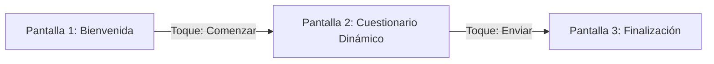

# Especificación de la Experiencia de Usuario (UX Specification) - FASE 2
## Sistema de Levantamiento Estratégico de Información - Grupo RunaFoto

Este documento especifica la experiencia de usuario (UX) del sistema móvil para la recopilación de datos y el panel web de analíticas de Grupo RunaFoto. Al ser una herramienta móvil de uso en campo/oficina durante 15 días, el diseño prioriza la velocidad de respuesta, el uso cómodo con una sola mano y una legibilidad óptima.

---

## 1. PRINCIPIOS DE DISEÑO UX
1.  **Cero Fricción de Entrada:** Sin pantallas de inicio de sesión complejas para el colaborador. Un click en el enlace abre el cuestionario listo para responder.
2.  **Uso con una Mano (Thumb Zone Friendly):** La navegación y los controles interactivos están colocados en el tercio inferior de la pantalla móvil (zona de fácil alcance con el dedo pulgar).
3.  **Progreso Visible y Continuidad:** Barra de progreso siempre visible. Si el colaborador cierra el navegador por accidente, al volver al enlace recuperará sus respuestas guardadas localmente.
4.  **Respuestas Rápidas e Intuitivas:** Alternativas táctiles de gran tamaño, listas arrastrables fluidas y cajas de texto que no obstaculicen el teclado móvil.
5.  **Aestética Premium y Profesional:** Paleta de colores sobria, tipografía moderna de alta legibilidad, y transiciones sutiles (micro-animaciones) que eliminan la sensación de "formulario aburrido".

---

## 2. ARQUITECTURA DE PANTALLAS (MÓVIL)

El flujo para colaboradores consta de exactamente **3 pantallas** principales, garantizando un recorrido ágil.

### Pantalla 1: Bienvenida y Contextualización
*   **Encabezado:** Logotipo simplificado de Grupo RunaFoto y etiqueta de la campaña (ej. "Hito: Descubrimiento Organizacional").
*   **Título Principal:** Rol o departamento evaluado (ej. "Cuestionario de Ventas" o "Evaluación Grupal: Producción").
*   **Cuerpo:** Bloque de texto persuasivo corto. Explica los principios del levantamiento (Confidencialidad, no es una evaluación de desempeño, objetivo de mejora).
*   **Metadatos de la sesión:** Muestra si es una encuesta "Individual" (Douglas) o "Grupal" (Departamento Ventas) y tiempo estimado de completado (10-12 min).
*   **Acción Principal:** Botón de ancho completo "Comenzar" posicionado en la parte inferior.

### Pantalla 2: Cuestionario Dinámico (Pregunta por Pregunta)
*   **Cabecera Fija (Sticky Header):**
    *   Mini logotipo de RunaFoto.
    *   Barra de progreso visual (línea delgada con animación de llenado al pasar de pregunta).
    *   Indicador numérico de progreso (ej. "Pregunta 3 de 10").
*   **Cuerpo (Zona Central):**
    *   Enunciado de la pregunta en tipografía contrastada.
    *   Contenedor del tipo de pregunta (ej. Tarjetas de opción múltiple, lista de ordenamiento arrastrable, o área de texto).
*   **Pie de Pantalla Fijo (Sticky Bottom Navigation):**
    *   Botón "Atrás" (con icono de flecha izquierda) en la esquina inferior izquierda.
    *   Botón principal "Siguiente / Guardar" o "Finalizar" de color destacado ocupando el 70% del ancho del pie en el lado derecho (zona primaria del pulgar).

### Pantalla 3: Agradecimiento y Confirmación
*   **Icono de Cierre:** Animación de checkmark SVG en color verde/azul turquesa.
*   **Mensaje Principal:** "¡Muchas gracias, [Nombre / Equipo]!"
*   **Subtexto:** "Tus respuestas han sido registradas de forma segura y servirán para estructurar el plan de transformación."
*   **Mensaje de Salida:** "Ya puedes cerrar esta ventana." (Sin acciones adicionales para evitar envíos duplicados o confusión).

---

## 3. ZONAS DE INTERACCIÓN (ERGONOMÍA MÓVIL)

Para facilitar el **uso con una sola mano**, se divide la interfaz móvil de la Pantalla 2 bajo el mapeo de la "Zona del Pulgar":

*   **Zona Inalcanzable (Tercio Superior):** Reservada para lecturas estáticas (Logotipo, barra de progreso y número de pregunta).
*   **Zona de Estiramiento (Centro):** Texto de la pregunta y zona de scroll de opciones.
*   **Zona de Confort (Tercio Inferior):** Opciones de respuesta táctiles, inputs de selección y los botones de navegación ("Siguiente", "Atrás").

---

## 4. SISTEMA DE DISEÑO VISUAL (TOKENS)

### Paleta de Colores
Utilizaremos una paleta inspirada en la fotografía profesional, sofisticada y con contrastes WCAG 2.1 AA para visualización en pantallas bajo luz solar.

| Token de Color | Valor Hex | Uso en la Interfaz |
|---|---|---|
| **Fondo Principal (Claro)** | `#FAFAFA` | Fondo general de la aplicación móvil (limpio, reduce fatiga ocular). |
| **Fondo Oscuro (Admin/Dark)** | `#0F172A` | Fondo del dashboard de administración (Slate 900, premium y analítico). |
| **Texto Primario (Claro)** | `#1E293B` | Títulos y cuerpo de preguntas (Slate 800, alto contraste). |
| **Texto Secundario** | `#64748B` | Textos de apoyo, subtítulos e instrucciones (Slate 500). |
| **Color Primario (Acento)** | `#6366F1` | Botones de acción, barra de progreso e indicadores activos (Indigo 500). |
| **Color Acento Secundario** | `#F59E0B` | Para destacar "Fugas de Valor" y alertas de riesgo (Amber 500). |
| **Superficie de Tarjeta** | `#FFFFFF` | Contenedores de preguntas y opciones de selección múltiple. |
| **Borde / Separador** | `#E2E8F0` | Líneas divisorias y bordes de inputs desactivados (Slate 200). |
| **Estado Éxito (Success)** | `#10B981` | Checkmarks y estados completados (Emerald 500). |

### Tipografía
Usaremos la fuente de Google Fonts **Inter** por su excelente rendimiento de renderizado en pantallas móviles de baja resolución y su legibilidad en textos cortos y datos numéricos.

*   **Títulos de Cuestionario (Pantalla de bienvenida):** `font-weight: 700`, `font-size: 24px`, `line-height: 32px`.
*   **Texto de Pregunta (Pantalla de cuestionario):** `font-weight: 600`, `font-size: 18px`, `line-height: 26px`.
*   **Opciones / Alternativas:** `font-weight: 500`, `font-size: 16px`, `line-height: 22px`.
*   **Textos de Soporte (Metadatos/Botonera):** `font-weight: 400`, `font-size: 14px`, `line-height: 20px`.

### Tamaños, Bordes y Espaciados (Layout)
*   **Márgenes Laterales:** `16px` en móvil, `24px` en tablet.
*   **Tamaño Mínimo del Área Táctil:** Todos los botones y tarjetas seleccionables tienen un área interactiva mínima de **`48px` de altura** para evitar toques erróneos.
*   **Espaciado de Opciones:** Las alternativas de selección múltiple tienen una separación vertical (margin-bottom) de `12px` para dar espacio al dedo.
*   **Bordes Redondeados (Border Radius):**
    *   Botones y Tarjetas de respuesta: `12px` (suave y moderno).
    *   Contenedores del Dashboard: `16px` (estilo panel flotante).

---

## 5. COMPORTAMIENTOS INTERACTIVOS (SVELTE)

*   **Feedback Táctil Inmediato:** Al tocar una opción de respuesta:
    1.  Cambia instantáneamente su color de borde a Primario (`#6366F1`) y fondo a un tono sutil (`#EEF2FF`).
    2.  Se activa una micro-vibración háptica del dispositivo (si está soportado por el navegador del móvil).
    3.  El botón "Siguiente" realiza una transición visual de desactivado (opacidad 0.5) a activo (opacidad 1).
*   **Tipo Ordenamiento (Drag and Drop táctil):**
    *   Para la pregunta de ordenamiento por prioridades, el usuario arrastra las opciones verticalmente.
    *   Al tocar el selector de arrastre, la tarjeta seleccionada se eleva visualmente mediante una sombra paralela (`box-shadow`) y se escala un `2%` (`transform: scale(1.02)`) para dar sensación física de agarre.
*   **Guardado Automático Local (Autosave):**
    *   Cada vez que se responde o modifica una opción, los datos se guardan en el `localStorage` en un objeto mapeado por el `token` del cuestionario.
    *   Una pequeña alerta flotante tipo Toast (duración 1.5s) o un sutil check en la barra superior indica: *"Guardado localmente"*.

---

## 6. ACCESIBILIDAD Y RENDIMIENTO (WCAG 2.1 AA)

*   **Contraste de Color:** La relación de contraste para todos los textos principales e interactivos supera el ratio **4.5:1** exigido por WCAG AA.
*   **Soporte de Zoom:** El layout se adaptará de forma fluida si el usuario tiene configurada una fuente de sistema más grande en los ajustes de accesibilidad de su celular.
*   **Carga Ultrarrápida (SEO/Performance):**
    *   Cero dependencias pesadas de estilos. CSS en línea o estructurado nativamente en Astro.
    *   Iconografía renderizada como inline SVG. No se importan fuentes de iconos externas (ej. FontAwesome).
    *   El HTML inicial renderizado por Astro pesa menos de **10KB**, garantizando carga en menos de 1 segundo incluso en conexiones móviles 3G/4G inestables.
